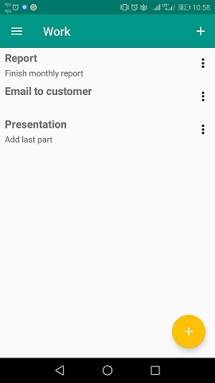

# TaskList Android App
## What is it?
TaskList is a simle app similiar to a well-known basic 'Todo App'. It allows the user to save notes or tasks and assign them to appropriate categories.

 

## How to use
This app uses Gradle build system. To build project, use "gradlew build" command or simply "Import Project" in Android Studio.
